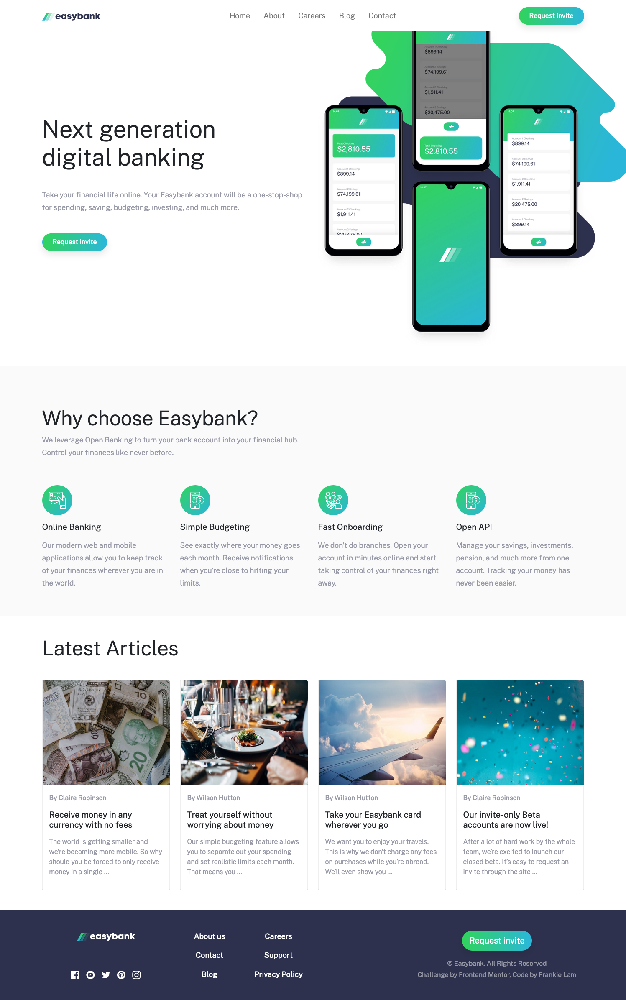
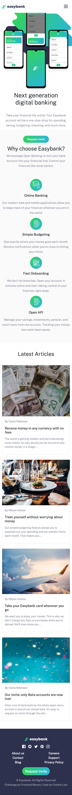
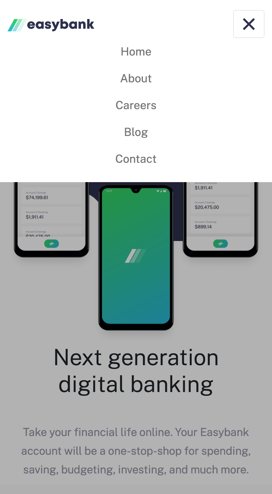

# Frontend Mentor - Easybank landing page solution

This is a solution to the [Easybank landing page challenge on Frontend Mentor](https://www.frontendmentor.io/challenges/easybank-landing-page-WaUhkoDN). Frontend Mentor challenges help you improve your coding skills by building realistic projects. 

## Table of contents

- [Overview](#overview)
  - [The challenge](#the-challenge)
  - [Screenshot](#screenshot)
  - [Links](#links)
- [My process](#my-process)
  - [Built with](#built-with)
  - [Why I took this challenge](#why-I-took-this-challenge)
  - [What I learned](#what-i-learned)
- [Author](#author)

## Overview

### The challenge

Users should be able to:

- View the optimal layout for the site depending on their device's screen size
- See hover states for all interactive elements on the page

### Screenshot

#### Desktop view


#### Mobile view


##### Mobile view with navigation being active


### Links

- Solution URL: [https://github.com/frankiecflam/sunnyside-landing-page](https://github.com/frankiecflam/sunnyside-landing-page)
- Live Site URL: [https://frankie-easybank.netlify.app/](https://frankie-easybank.netlify.app/)

## My process

### Built with

- Semantic HTML5 markup
- Bootstrap 5 with custom variables
- SASS
- Mobile-first workflow

### Why I took this challenge
This is a coding challenge from Frontend mentor. The main purpose of coding this website is to practise my newly-learned Bootstrap 5.


### What I learned

#### Bootstrap 5
Throughout this project, I made use of plenty of Bootstrap 5's features, including typography, card & navbar components and utility classes.
Bootstrap performed outstandingly in terms of mobile responsiveness, with tons of pre-made components in its arsenal.

```html
<h1 class="display-4">Next generation <br>digital banking</h1>
```

## Author

- Email - [Frankie Lam](cfl.frankie@gmail.com)
- Instagram - [@frankie___lam](https://www.instagram.com/frankie___lam)
- Facebook - [@Frankie Lam](https://www.facebook.com/frankiecflam)